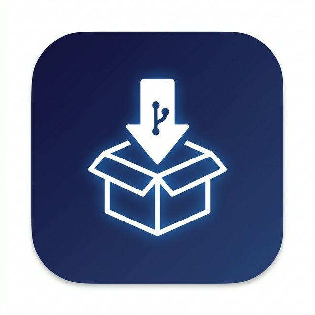

<p align="center">
  
</p>

<h1 align="center">GitInstaller</h1>

<p align="center">
  <strong>Paste a GitHub URL → get a working, launchable local install — zero terminal knowledge required.</strong>
</p>

<p align="center">
  
  
  
  
</p>

---

GitInstaller is a desktop application that turns any GitHub repository into a one-click local install. It reads the repo's documentation, uses an LLM to generate an execution plan, and runs it — cloning, creating virtual environments, installing dependencies, and generating launchers — all without you touching a terminal.

## ✨ Features

### Core
- 🧠 **AI-Powered Plans** — Analyzes README/INSTALL docs via OpenRouter (MiMo-v2-flash) and generates step-by-step shell commands
- 🔍 **Plan Review** — See every command before it runs. Approve, cancel, or go back
- ⛔ **Cancel Anytime** — Abort a running installation and kill the entire process tree
- 🔄 **Retry / Skip** — When a step fails, retry it or skip and continue with the rest
- 🐍 **Sandboxed Environments** — Auto-creates Python venvs so nothing touches your system
- 🎨 **Auto WebUI Generation** — Detects CLI/library tools and generates a Gradio interface with consistent theming via `data/design.md`

### UX
- 🖼️ **Resizable Window** — Responsive layout, 960×700 default with 800×600 minimum
- 🔗 **Smart Input** — Paste `owner/repo`, `github.com/owner/repo`, or a full URL
- 🔍 **Search & Filter** — Find installed projects instantly
- 🎯 **Drag & Drop** — Drop GitHub URLs directly into the app
- ⌨️ **Keyboard Shortcuts** — `Escape` closes modals, `Ctrl+V` auto-focuses input
- 🌓 **Dark / Light Theme** — Toggle with persistence across sessions
- 📊 **Status Badges** — See ✅ Installed, ⚠️ Partial, or ❌ Failed at a glance
- ⏱️ **Timestamps** — "3h ago", "5d ago" on every project card

### Compatibility
- 🖥️ **Cross-Platform** — Windows, macOS, and Linux support via `core/platform_utils.py`
- 📦 **Node.js Support** — Detects `package.json`, runs `npm install`, generates proper launchers
- 🔒 **Private Repos** — Add a GitHub Personal Access Token in Settings for private repository access
- 💾 **Plan Caching** — Reuse previous AI plans without another API call
- 📐 **Size Estimation** — See repo size before installing

### System
- 🖼️ **Custom App Icon** — Branded icon in title bar, taskbar, and system tray
- 🔔 **System Tray** — Minimize to tray with Show/Quit controls
- 🚀 **Auto-Launch WebUI** — Generated WebUIs open directly in your browser

## 📁 Project Structure

```
GitInstaller/
├── app.py                  # Main entry point + API
├── core/
│   ├── claude_analyzer.py  # LLM plan generation
│   ├── executor.py         # Step execution + process management
│   ├── github_fetcher.py   # GitHub API + repo metadata
│   ├── launcher_gen.py     # .bat/.sh launcher generation
│   ├── platform_utils.py   # Cross-platform abstractions
│   ├── project_manager.py  # Project storage + config
│   └── webui_gen.py        # Gradio WebUI generation
├── frontend/
│   ├── index.html          # UI structure (6 screens)
│   ├── style.css           # Responsive dark/light themes
│   ├── app.js              # Frontend logic
│   ├── icon.png            # App icon (PNG)
│   └── icon.ico            # App icon (ICO for Windows)
├── data/
│   ├── design.md           # Gradio WebUI theme spec (swappable)
│   ├── config.json         # App settings
│   ├── projects.json       # Installed project registry
│   └── plans/              # Cached AI plans
├── bundled/
│   ├── python/             # Optional portable Python
│   ├── git/                # Optional portable Git
│   └── node/               # Optional portable Node.js
└── requirements.txt
```

## 🚀 Installation & Setup

1. **Clone:**
   ```bash
   git clone https://github.com/arjun-arihant/gitinstaller.git
   cd gitinstaller
   ```

2. **Install dependencies:**
   ```bash
   pip install -r requirements.txt
   ```

3. **Configure API key:**
   - Copy `.env.example` to `.env` and add your OpenRouter API key, **or**
   - Set it in the app's Settings menu (⚙️ icon)

4. **Run:**
   ```bash
   python app.py
   ```

## ⚙️ Configuration

All configuration is stored locally:

| Setting | Location | Description |
|---------|----------|-------------|
| OpenRouter API Key | `.env` or Settings | Required for AI plan generation |
| GitHub Token | `.env` or Settings | Optional, for private repositories |
| Theme | Settings toggle | Dark (default) or Light |
| Install Path | Home screen | Where repos get installed |

## 📦 Bundled Runtimes (Optional)

For fully standalone operation without system dependencies:

| Runtime | Drop into | Purpose |
|---------|-----------|---------|
| **Python** | `bundled/python/` | Isolated venv creation |
| **Git** | `bundled/git/` | Cloning without system Git |
| **Node.js** | `bundled/node/` | npm/npx for Node projects |

> Bundled binaries are gitignored. Directory stubs are kept via `.gitkeep`.

## 🎨 WebUI Theming

All generated Gradio WebUIs follow `data/design.md` — a drop-in replaceable design spec that defines colors, fonts, spacing, and branding. Swap this file to change the look of every future generated WebUI.

## 📄 License

MIT
