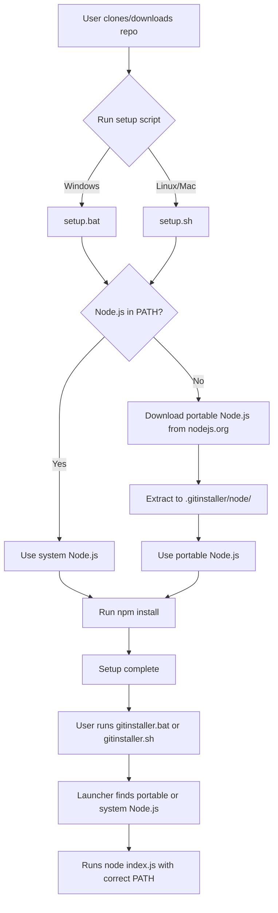
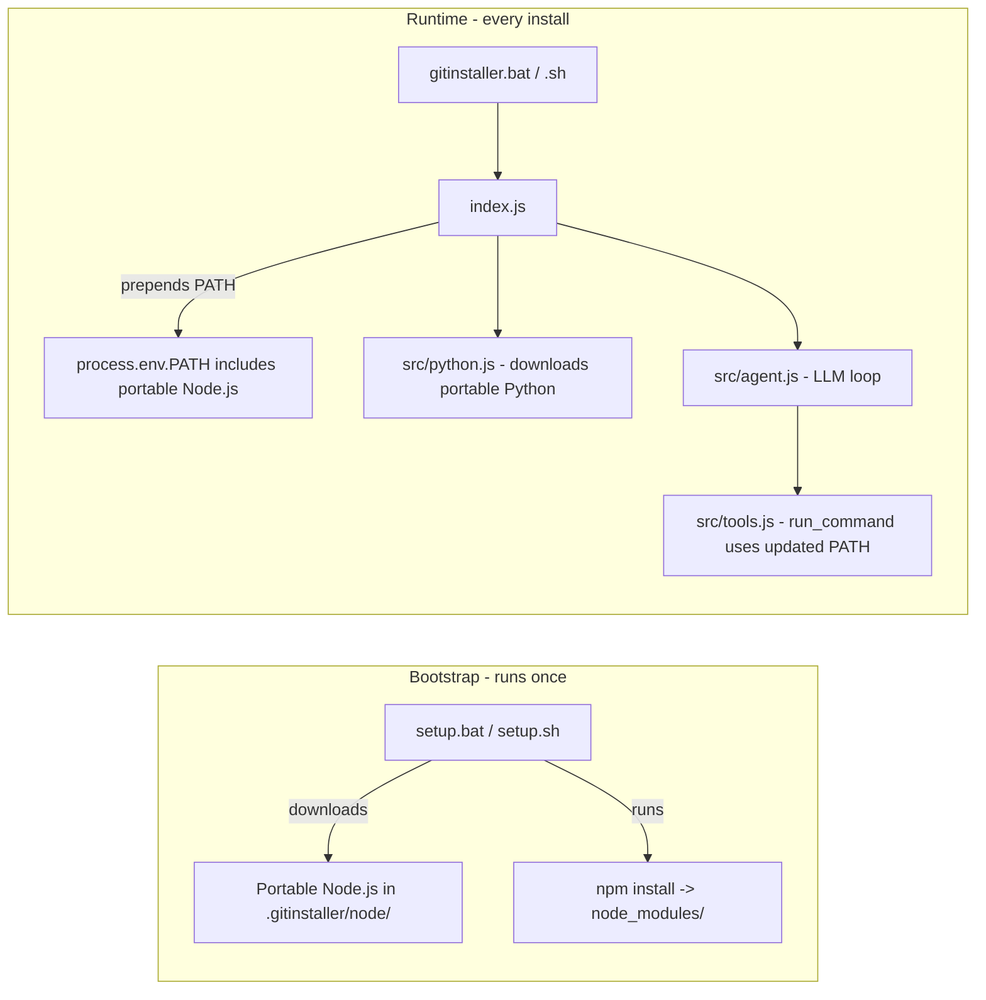

# Plan: Make GitInstaller Work on Fresh OS Installs

## Problem

GitInstaller requires Node.js 18+ to run, but on a brand new PC nothing is installed. The tool already solves this for Python (via `python-build-standalone` auto-download in `src/python.js`), but **Node.js itself is the unsolved dependency**.

Additionally, on Windows, `spawn("npm", [...], { shell: false })` silently fails because `npm` is a `.cmd` batch script — not a real executable.

## Solution Overview



## Files to Create

### 1. `setup.bat` — Windows Bootstrap

Uses PowerShell (available on all Windows 10+) to:
1. Check if Node.js exists in PATH
2. If not, download the Node.js LTS `.zip` from `nodejs.org`
3. Extract to `.gitinstaller/node/` using PowerShell `Expand-Archive`
4. Run `npm install` to set up `node_modules/`

Node.js URL pattern: `https://nodejs.org/dist/v{VERSION}/node-v{VERSION}-win-x64.zip`

### 2. `setup.sh` — Linux/Mac Bootstrap

Uses `curl` (or `wget` fallback) to:
1. Check if Node.js exists in PATH
2. If not, download the Node.js LTS `.tar.xz` from `nodejs.org`
3. Extract to `.gitinstaller/node/` using system `tar`
4. Run `npm install`

Node.js URL patterns:
- Linux x64: `node-v{VERSION}-linux-x64.tar.xz`
- macOS ARM: `node-v{VERSION}-darwin-arm64.tar.gz`
- macOS Intel: `node-v{VERSION}-darwin-x64.tar.gz`

### 3. `gitinstaller.bat` — Windows Launcher

```
@echo off
- Looks for .gitinstaller/node/node.exe first
- Falls back to system node
- Prepends portable Node.js dir to PATH (so npm.cmd is findable)
- Runs: node index.js %*
```

### 4. `gitinstaller.sh` — Linux/Mac Launcher

```
#!/bin/bash
- Looks for .gitinstaller/node/bin/node first
- Falls back to system node
- Prepends portable Node.js dir to PATH
- Runs: node index.js "$@"
```

## Files to Modify

### 5. `index.js` — PATH Setup for Child Processes

At startup, detect if portable Node.js exists in `.gitinstaller/node/` and prepend its directory to `process.env.PATH`. This ensures:
- The LLM agent's `run_command("npm", ...)` calls find `npm.cmd`/`npm`
- The LLM agent's `run_command("npx", ...)` calls work
- Any child processes spawned also have access to Node.js

```javascript
// After loadEnv(), before main logic:
const portableNodeDir = resolve(__dirname, ".gitinstaller", "node");
if (existsSync(portableNodeDir)) {
  const sep = process.platform === "win32" ? ";" : ":";
  process.env.PATH = portableNodeDir + sep + process.env.PATH;
}
```

### 6. `src/tools.js` — Fix `run_command` for Windows `.cmd` scripts

**Current bug:** `spawn("npm", [...], { shell: false })` fails on Windows because `npm` is `npm.cmd` — a batch script that requires a shell to execute.

**Fix:** Use `shell: true` on Windows. The existing `validateCommand()` already blocks dangerous commands (`cmd`, `bash`, `powershell`, etc.) and injection patterns (`&&`, `||`, `;`, backticks, `$(`), so this is safe.

```javascript
const proc = spawn(args.command, args.args || [], {
  cwd: projectDir,
  shell: process.platform === "win32",  // .cmd files need a shell on Windows
  signal: ac.signal,
  env: { ...process.env, PATH: process.env.PATH },
});
```

### 7. `src/python.js` — Replace system `tar` with pure JS extraction

Replace the `spawn("tar", ...)` call with Node.js built-in `zlib.createGunzip()` and a minimal tar stream parser. This eliminates the last system tool dependency.

The tar format is simple: 512-byte header blocks followed by file data rounded to 512 bytes. We only need to extract files — we don't need compression/creation support.

Alternatively, we can add a lightweight `tar` npm dependency (maintained by npm/GitHub themselves). This would be more robust than hand-rolling a tar parser.

**Decision point:** Adding a `tar` npm dep vs. writing a ~80-line tar extractor. The dep is safer and more maintainable.

### 8. `README.md` — Updated Setup Instructions

Replace the current setup section with:

```markdown
## Quick Start (Fresh PC — No Prerequisites)

### Windows
1. Download or clone this repository
2. Double-click `setup.bat` (or run it from Command Prompt)
3. Create a `.env` file with your OpenRouter API key
4. Run: `gitinstaller.bat install https://github.com/user/repo`

### Linux / macOS
1. Download or clone this repository
2. Run: `./setup.sh`
3. Create a `.env` file with your OpenRouter API key
4. Run: `./gitinstaller.sh install https://github.com/user/repo`

Node.js is downloaded automatically if not installed.
```

## Architecture After Changes



## Dependency Chain After Changes

| Dependency | Status | How Handled |
|---|---|---|
| Node.js | ✅ | Auto-downloaded by setup.bat/setup.sh |
| npm | ✅ | Bundled with portable Node.js |
| Python | ✅ | Already auto-downloaded via python-build-standalone |
| tar (system) | ✅ | Replaced with JS-based extraction |
| Git | ✅ | Not needed - repo downloaded as ZIP |
| PowerShell | ✅ | Built into Windows 10+ (used only by setup.bat) |
| curl | ✅ | Built into Linux/Mac (used only by setup.sh) |

## Node.js Version

Use Node.js 22 LTS. Hardcode the version in the setup scripts for reproducibility. The version constant should be easy to update (single variable at the top of each script).

## Security Considerations

- The `shell: true` change on Windows is safe because `validateCommand()` already blocks shell-dangerous commands and injection patterns
- Portable Node.js is downloaded from the official `nodejs.org` domain over HTTPS
- The `.gitinstaller/` directory is already in `.gitignore`
